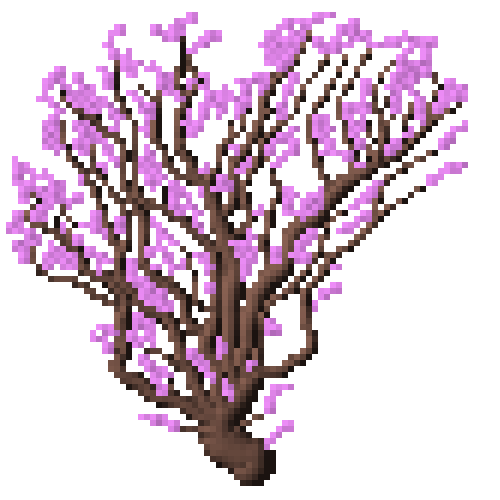

# pixel-bonsai

## What is this

It generates pixelated trees

## Explain
A picture speaks a thousand words, sooo



## How do I generate my own tree?

```
git clone https://github.com/JM4ier/pixel-bonsai.git
cd pixel-bonsai
rustup override set nightly
cargo run --release
```
